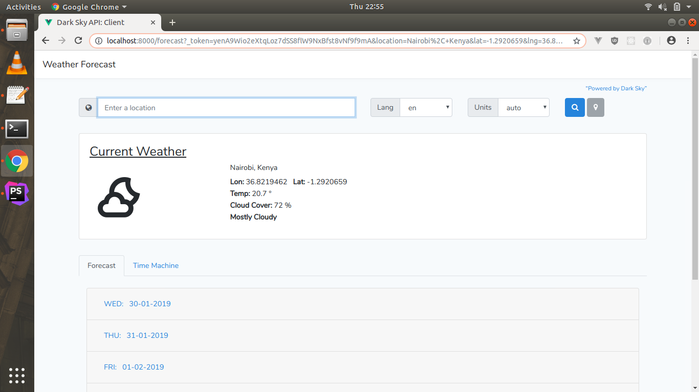

# Technical assignment back-end engineer
An application that allows the user to view the observed (in the past 30 days) or forecasted (in the future) daily weather conditions for a given location using the [Dark Sky API](https://darksky.net/dev/docs).

#Requirements
- PHP 7
- NGINX OR APACHE


#  Clone GitHub repo for this project locally

```git
git clone https://github.com/songokjesse/technical-assignment-back-end-engineer-songokjesse

cd /to project
```

# Installation
Install composer and npm dependencies
```composer
1. composer install
2. yarn or npm install
```
 
Create a copy of your .env file
 ```dotenv
 cp .env.example .env
```
Generate an app encryption key
```dotenv
php artisan key:generate
```

# Settings
Get Dark Sky API KEY from [Dark Sky API](https://darksky.net/dev/docs) 
Get Google Geocoding API Key for getting location from [GEOCODING API](https://developers.google.com/maps/documentation/geocoding/start#get-a-key)
Add your api keys to .env
```dotenv
DARK_SKY_ID=[YOUR KEY]
GOOGLE_GEOCODING_API_KEY=[YOUR KEY]
```

# screenshot



## Contributing
Pull requests are welcome. For major changes, please open an issue first to discuss what you would like to change.

Please make sure to update tests as appropriate.

## License
[MIT](https://choosealicense.com/licenses/mit/)
